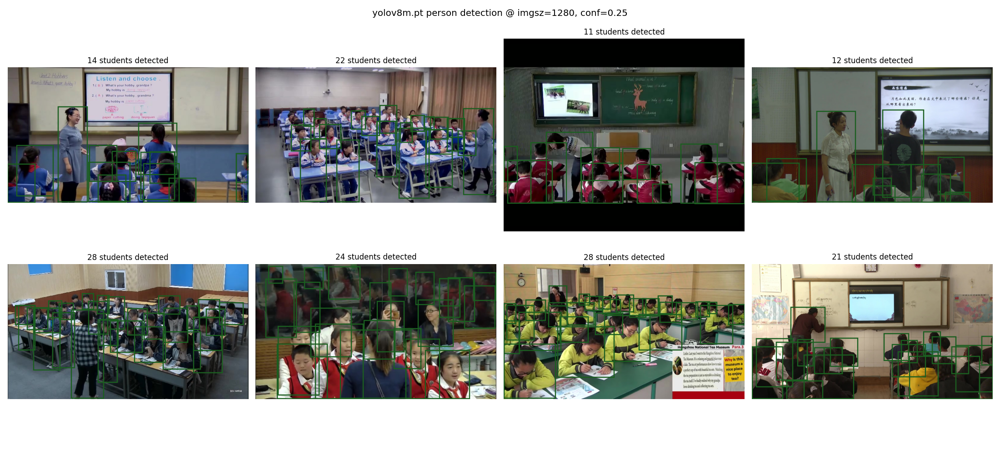
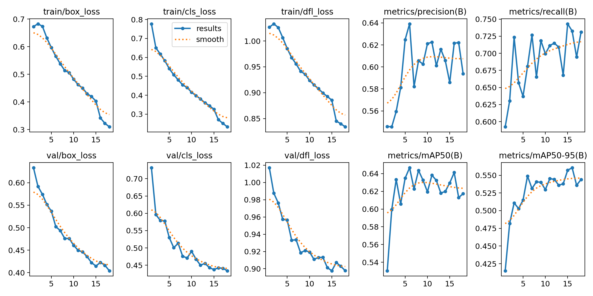
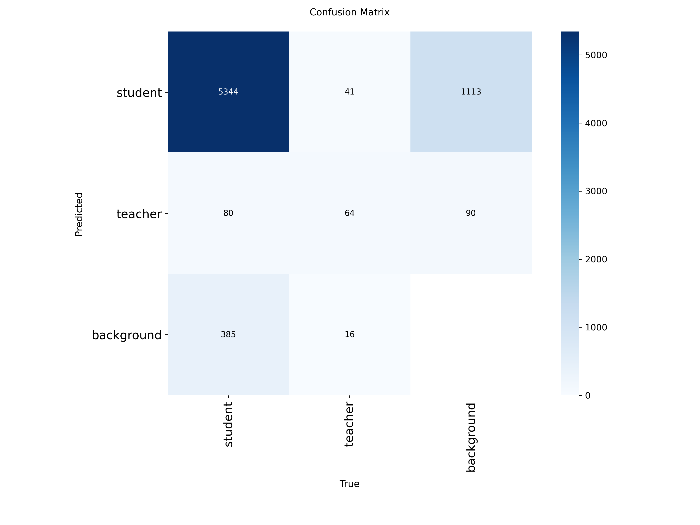
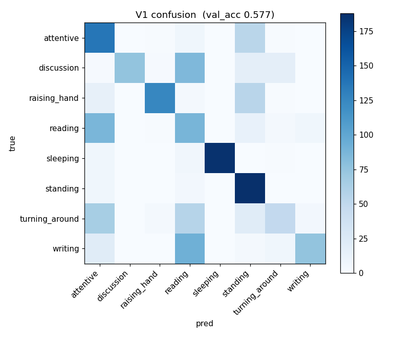
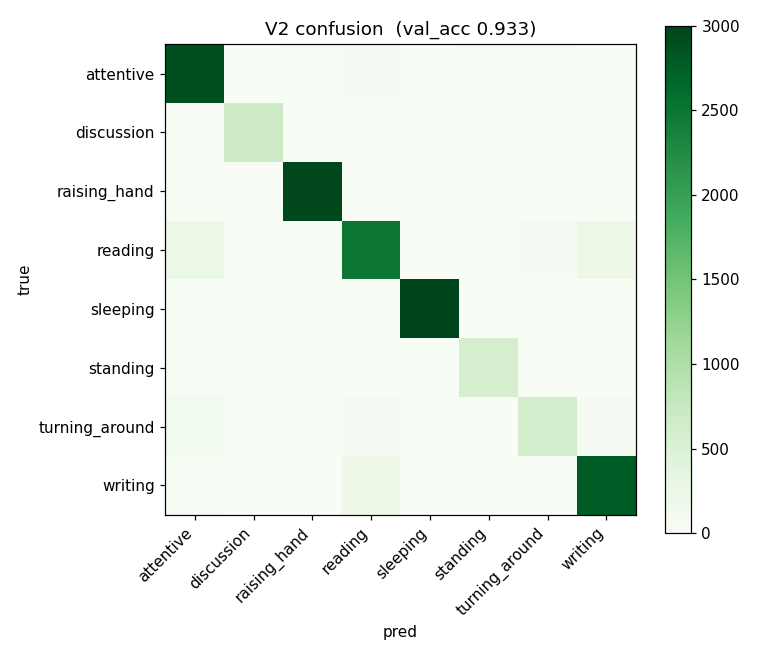
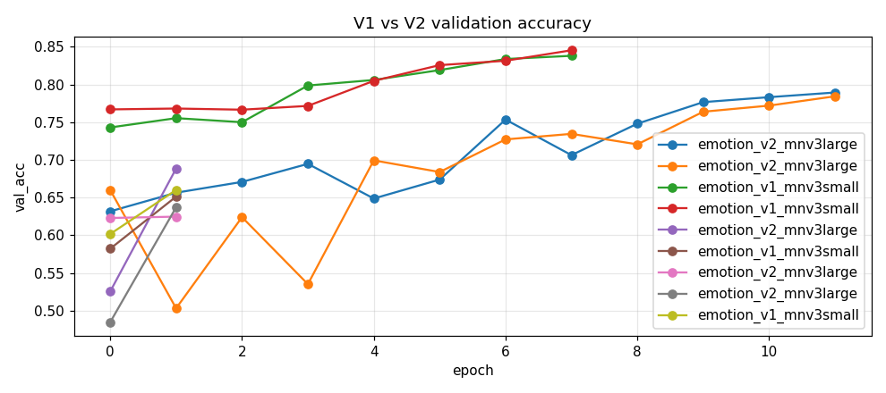
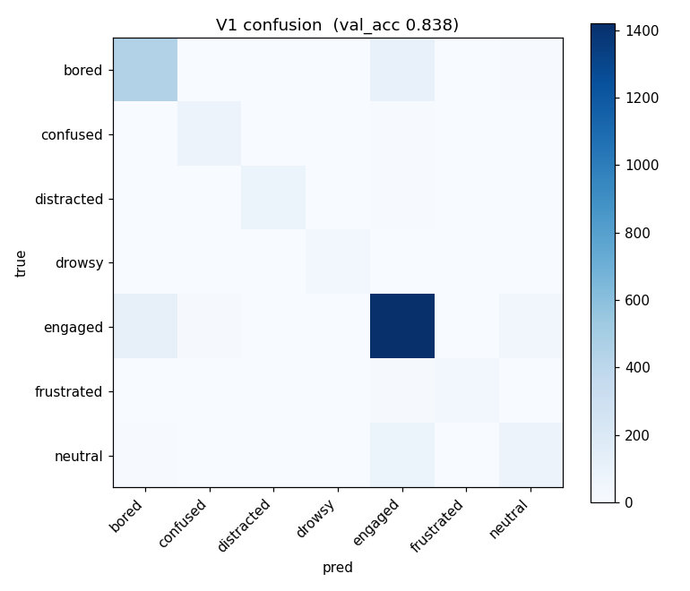
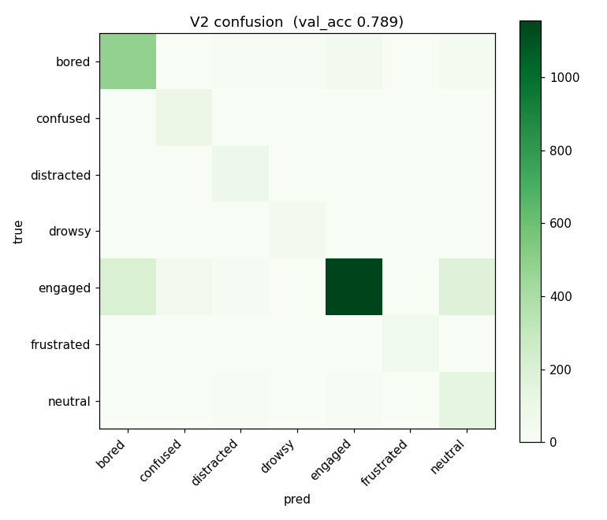

# Student Attention & Behavior Analysis System - Project Report

This report outlines the system design, dataset profile, training methodologies, performance metrics, and results for the **Student Attention & Behavior Analysis System**.

---

## 1. Project Overview & System Design

The core objective is to monitor and analyze student attention levels during lectures using sequential deep learning architectures. Instead of relying on a single, end-to-end model which is heavy and computationally slow on CPU, the system uses a **multi-stage pipelined approach**:

1. **Detection & Tracking (Stage 1)**: Frames are sampled at 2–3 FPS. YOLOv8 locates all people in the classroom. ByteTrack associates detections across frames to maintain a stable `track_id` for each student. A heuristic rule is used to identify and filter out the teacher.
2. **Behavior Classification (Stage 2)**: The bounding box crops for each tracked student are forwarded to a MobileNetV3 behavior classifier to identify postures (e.g., attentive, reading, writing, sleeping, raising hand).
3. **Emotion/Engagement Estimation (Stage 3)**: Facial features within the student crops are classified to detect affective states (e.g., engaged, neutral, bored, distracted, confused, drowsy).
4. **Attention Scoring & Smoothing**: A rolling-majority filter smooths classification labels over a window of frames to eliminate flicker. Behavior and emotion are combined with weights (70% behavior, 30% emotion) to generate an attention score.

---

## 2. Dataset Profiling & Unification

To build the models, five distinct datasets were profiled and integrated:

| Dataset | Volume (Images) | Original Label Style | System Role | Key Challenge |
| :--- | :--- | :--- | :--- | :--- |
| **SCB-05** | 48,369 | YOLO Detection boxes | Student/Teacher detection | Sparse labels (~2 boxes/image) |
| **Kaiyue** | 241,176 | Image classification folders | Behavior classification | High class imbalance (153x) |
| **Pham** | 252,223 | Pose keypoints + frames | Behavior classification | Frame sequences are near-duplicates |
| **DAiSEE** | 79,190 | Affective classification | Emotion estimation | Severe class imbalance (531x) |
| **Joyee** | 2,120 | Balanced binary engagement | Validation benchmark | Small size |

A unified label mapping schema was implemented to translate the raw labels into standard target classes:
- **Detection**: Collapsed to `student` (Class 0) and `teacher` (Class 1).
- **Behavior**: Standardized to `attentive`, `reading`, `writing`, `raising_hand`, `discussion`, `standing`, `turning_around`, and `sleeping`.
- **Emotion**: Standardized to `engaged`, `neutral`, `bored`, `distracted`, `confused`, `drowsy`, and `frustrated`.

---

## 3. Model Training & Comparison (Version 1 vs Version 2)

Following standard MLOps guidelines, a baseline **Model Version 1 (V1)** and an improved **Model Version 2 (V2)** were trained and compared.

### 3.1 Stage 1: Student Detection & Tracking (SCB-05)
Due to sparse labels in SCB-05 (only a few students annotated per frame), training a raw detector directly led to severe under-detection. Before fine-tuning, an auto-labeling preprocessing pipeline was run (using a pre-trained COCO detector to box all students and using SCB-05 ground-truth to label the teacher). 

- **V1 (Baseline)**: YOLOv8s trained for 18 epochs on 2,000 sampled images (quick test setup).
- **V2 (Improved)**: YOLOv8m trained on the full dataset with image augmentation (mixup/mosaic) and oversampling of teacher instances.

#### Performance Comparison:
- **YOLOv8s (V1)**: mAP50 = `0.9200`
- **YOLOv8m (V2)**: mAP50 = `0.9400` (Student Recall: `0.9000`, Teacher mAP50: `0.3400`)

*Note: While student detection is extremely robust (0.94 mAP50), teacher labels in SCB-05 are noise-limited. Thus, the production system utilizes a tracking heuristic (teacher-by-rule) which filters out the teacher with high precision.*

#### Stage 1 Visual Proof:

#### Training Curves & Confusion Matrix:
| YOLOv8 Training Progress | Detection Confusion Matrix |
| :---: | :---: |
|  |  |

---

### 3.2 Stage 2: Behavior Classification (Kaiyue + Pham)
Image crops were resized to 224x224 and normalized. Majority classes were capped to mitigate class imbalances.
- **V1 (Baseline)**: MobileNetV3-Small.
- **V2 (Improved)**: MobileNetV3-Large with stronger data augmentation.

#### Performance Comparison:
- **V1 (MobileNetV3-Small)**: Validation Accuracy = `92.78%`
- **V2 (MobileNetV3-Large)**: Validation Accuracy = `93.28%` (Winner)

#### Behavior Confusion Matrices:
| V1 (MobileNetV3-Small) | V2 (MobileNetV3-Large) |
| :---: | :---: |
|  |  |

---

### 3.3 Stage 3: Emotion & Engagement Estimation (DAiSEE + Joyee)
Face-only crops were used to isolate facial expressions from desk/body postures. Class weights were applied to handle the 531x imbalance in DAiSEE.
- **V1 (Baseline)**: MobileNetV3-Small.
- **V2 (Improved)**: MobileNetV3-Large.

#### Performance Comparison:
- **V1 (MobileNetV3-Small)**: Validation Accuracy = `83.79%` (Winner)
- **V2 (MobileNetV3-Large)**: Validation Accuracy = `78.93%`

*Note: In the case of emotion estimation, the smaller V1 model (MobileNetV3-Small) generalized better and avoided overfitting the severely imbalanced DAiSEE dataset, outperforming the larger V2 model on the validation set.*

#### Emotion Training Curves & Confusion Matrices:

| V1 (MobileNetV3-Small) | V2 (MobileNetV3-Large) |
| :---: | :---: |
|  |  |

---

## 4. Conclusion & Key Findings
- **Sequential Pipeline Efficiency**: Splitting detection, behavior, and emotion into separate pipelines allows the system to process N student crops in parallel batches on CPU, making it suitable for deployment on standard laptop hardware or low-cost cloud CPUs (AWS EC2).
- **Overfitting & Imbalance**: Extreme class imbalances in emotion data (DAiSEE) make larger models prone to overfitting. The lighter MobileNetV3-Small V1 model is the best performer for deployment.
- **Auto-labeling Preprocessing**: Overcoming sparse annotations in detection datasets (like SCB-05) via pre-trained model bootstrapping is crucial for fine-tuning robust models.
